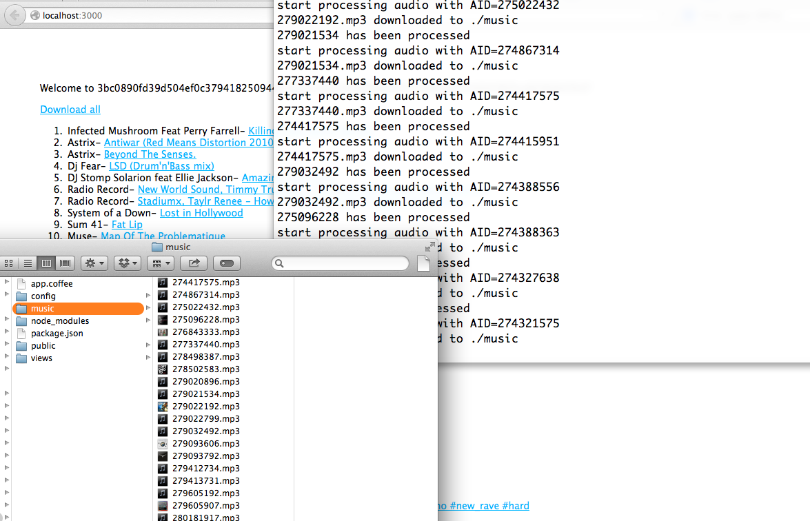
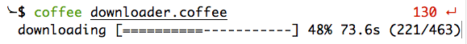
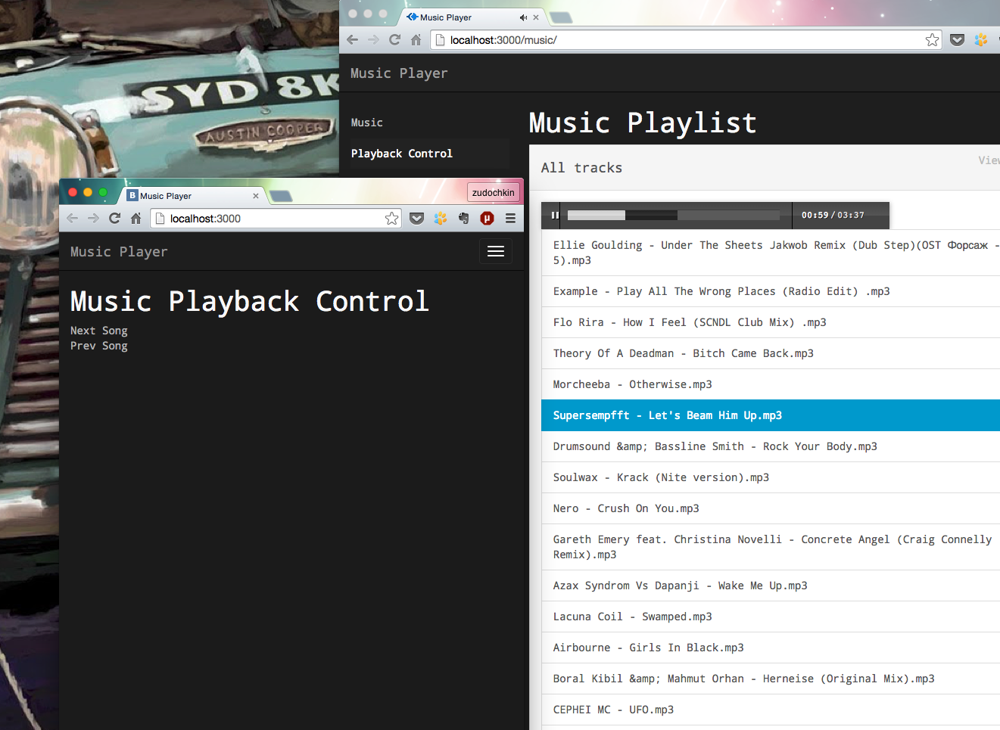

# VK.com simple music downloader

To download the whole music from your VK.com audio collection, you should do those simple steps:

1. `cp config/credentials.example.json config/credentials.json`
2. change APP_ID and APP_SECRET with your own credentials [Applications list](http://vk.com/apps?act=settings)
3. install dependencies `npm install`
4. start application by running `npm start`
5. follow the link [http://localhost:3000](http://localhost:3000)
6. click **Sign in** link and allow access to your music collection
7. If everything is alright, you should see **Download all** link
8. By clicking it you'll start downloading process
9. You can filter by music albums and download the whole playlist
10. Then go get a beer so you can relax while your music is downloading

### Command Line tool for music downloading
Follow the (1-5) steps on listed above and start command line downloader by `coffee downloader.coffee`.
You'll see progress bar that looks like image below

#### Extra Bonus

Stom downloader server and run another one from **_webserver** folder with command `node bin/www`.

Symlink music folder to public (folders not yet supported) and that's it.

Webserver with js player. You will be able to play next or previous song over local network or internet. On computer with powerful acoustic you should open browser
on http://localhost:3000/music page. For remote control follow the  http://localhost:3000/music page and you'll see two links: one for next and one for prev
song playback control.

